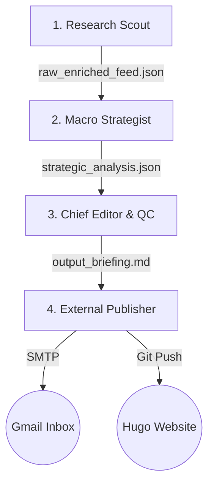

# Digital Asset Intelligence Engine (Project ID: DA-INTEL-01)

An automated, multi-agent pipeline designed to discover, enrich, filter, and synthesise weekly regulated wholesale institutional digital asset developments into a publication-ready brief. 

Outputs are delivered directly as a styled HTML newsletter to my Gmail and auto-deployed as a markdown post to my Hugo-based website.

---

## Multi-Agent Execution Graph

The engine runs as a sequence of three virtual agents, followed by an automated publishing coordinator:



1. **The Research Scout (`scout`)**
   - **Trigger**: Instantiated via scheduler or manually.
   - **Action**: Invokes `pipeline/ingestion.py` to scrape high-signal RSS feeds (CoinDesk, The Block, the Bank for International Settlements, Ledger Insights, the European Central Bank, and the Bank of England).
   - **Enrichment**: Inspects articles for institutional programs (e.g. Project Agorá, mBridge, Regulated Liability Networks, Project Cedar) and gathers primary-source specification details via web search.
   - **Output**: Writes combined raw/enriched feed items to `shared_artifacts/raw_enriched_feed.json`.

2. **The Macro Strategist (`strategist`)**
   - **Trigger**: Fired immediately upon validation of the raw feed.
   - **Action**: Applies a strict institutional "Noise Gate" filter to remove retail speculative noise (spot prices, memecoins, consumer wallets, and retail volumes).
   - **Categorisation**: Organises approved developments into four core pillars and synthesises their impact on cross-border liquidity and capital efficiency.
   - **Output**: Writes the structured payload to `shared_artifacts/strategic_analysis.json`.

3. **The Chief Editor & QC (`editor`)**
   - **Trigger**: Fired immediately upon validation of the strategic analysis.
   - **Action**: Compiles the final briefing in **strict British English** spelling (e.g., *tokenised*, *tokenisation*, *utilising*, *programmes*). Evaluates the brief against QC rules to remove generic AI fluff and hedging phrases.
   - **Output**: Writes the compiled briefing file to `pipeline/output_briefing.md`.

4. **The External Publisher (`publisher`)**
   - **Action**: Invokes `pipeline/publish.py` to convert the markdown briefing into an HTML newsletter, sends it via SMTP Gmail, prepends YAML frontmatter, and commits/pushes the new post to the Hugo website directory.

---

## File Structure

```text
da-intel-agentic/
├── .agent/
│   └── agents.md          # Multi-agent execution graph definition
├── .github/
│   └── workflows/
│       └── intelligence_engine.yml # GitHub Actions workflow scheduler
├── pipeline/
│   ├── ingestion.py       # Base feed harvesting and parsing logic
│   ├── publish.py         # SMTP transmission and Git push automation
│   └── run_pipeline.py    # Main pipeline orchestrator (Gemini API sequence)
├── shared_artifacts/      # Intermediate JSON payloads (gitignored)
├── .gitignore             # Local files exclusion configuration
├── requirements.txt       # Python dependencies for local & CI environments
└── README.md              # Project documentation
```

---

## Getting Started

### Prerequisites
- Python 3.11 or higher installed locally.
- Git installed (for committing and pushing changes).

### Environment Configuration
The pipeline loads credentials from your environment variables. Under Windows, it will fallback to checking your User Environment registry (`HKEY_CURRENT_USER\Environment`). 

Ensure the following variables are configured:
- `GEMINI_API_KEY`: Your Google Gemini API key.
- `SMTP_USER`: Your Gmail address.
- `SMTP_PASS`: Your Gmail App Password (generated via Google Account settings).
- `RECIPIENT_EMAIL`: The destination address for the briefing (defaults to `SMTP_USER` if not set).

---

## Execution

### Local Run
To execute the entire pipeline end-to-end (ingest, filter, write, email, and publish to Hugo):
```bash
python pipeline/run_pipeline.py
```

### Dry Run (Testing End-to-End Delivery)
To execute the entire pipeline, including scraping feeds and compiling the briefing locally via Gemini, without making SMTP connections or pushing commits to the live Hugo website:
```bash
python pipeline/run_pipeline.py --dry-run
```

---

## Automated Weekly Deployment

Weekly runs are orchestrated automatically via **GitHub Actions** every Monday morning.

### Required Repository Secrets
To support remote execution, go to your repository settings (`Settings -> Secrets and variables -> Actions`) and add the following repository secrets:
- `GEMINI_API_KEY`
- `SMTP_USER`
- `SMTP_PASS`
- `RECIPIENT_EMAIL`
- `HUGO_REPO_PAT`: A GitHub Personal Access Token (PAT) with write permissions for my `sunilkandola-hugo` site repository.

---

## Quality Control (QC) Directives
All briefings generated by the engine must adhere to the following compliance rules:
* **No AI Fluff**: Avoid vague, hedging phrases or generic AI-isms. Present facts directly.
* **Primary Source Integrity**: Direct markdown links must use the actual article source URLs (e.g., CoinDesk, BIS, etc) propagated from the ingestion feed, rather than generic search links.
* **Link Normalisation**: Malformed, relative or placeholder links are automatically intercepted and normalised to safe, absolute Google Search query URLs to prevent local 404 errors on the Hugo site or email template.
* **Strict British English**: Americanised variants (e.g. *-ize*, *-ization*, *-ized*) are strictly banned.
